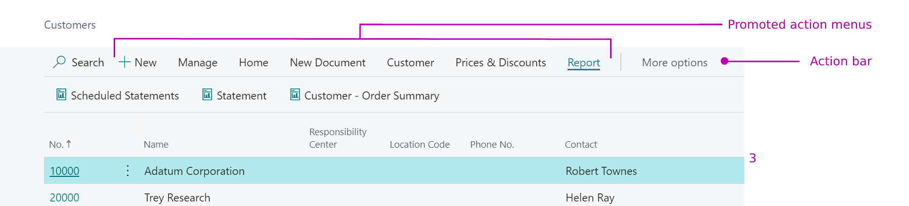
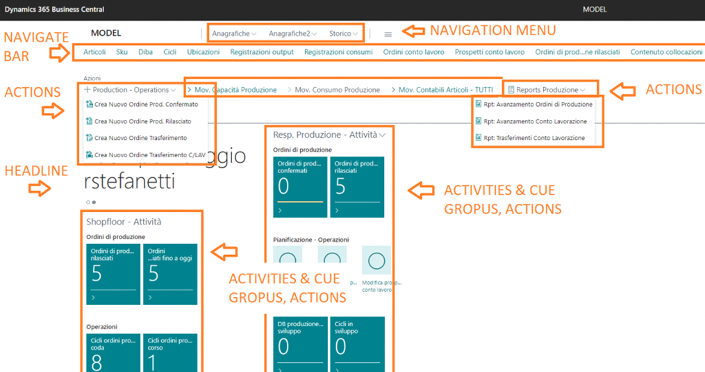
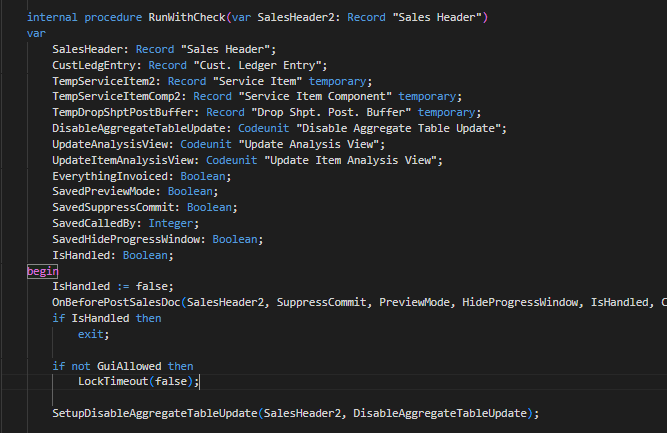

# 🔴 Zkopírování repository z DevOps

    clone repository z master větve a vytvoření projektu ve VSCode

---
# 🔴 Stáhnutí symbolů 
    1. stažení extension - AL Language extension for Microsoft Dynamics 365 Business Central
    je duležitá pro build, intellisense, ALGO, downloadSymbols

---
    2. použít příkaz download symbols

---
    3. automaticky se vytvoří launch.json
---
## 🟡 Popis workspace
- Ukládat a obnovovat stav uživatelského rozhraní spojený s daným pracovním prostorem (například otevřené soubory).

- umožňuje seskupit různé složky projektu do jedné pracovní oblasti.

Translated with DeepL.com (free version)
```json
// syntax workspace
{
	"folders": [
		{
			"path": ".build"
		},
		{
			"path": ".logs"
		},
		{
			"path": ".alpackages"
		},
		{
			"path": ".netpackages"
		},
		{
			"path": "CHVALIS-General" // app 1
		},
		{
			"path": "Tests-CHVALIS-General" // app 2
		},
	],
	"settings": {
		"workbench.colorCustomizations": {
			//"tab.inactiveBackground": "#000000",
			//"tab.activeBackground": "#5c5c5c"
		},
		"al.packageCachePath": "../.alpackages", //symbols
		"al.assemblyProbingPaths": [
			"../.netpackages"
		],
		// Custom Settings:
		"editor.codeLens": false,
		"al.backgroundCodeAnalysis": "Project",
		"al.enableCodeAnalysis": true,
		"al.codeAnalyzers": [
			"${AppSourceCop}",
			"${CodeCop}"
		],
		"al.ruleSetPath": "../CHVLRuleSet.json", // RuleSet
		"al.incrementalBuild": false,
		"al.enableCodeActions": false,
		"al.compilationOptions": {},
		// CRS settings:
		"CRS.FileNamePatternExtensions": "<ObjectNameShort>.<ObjectTypeShortPascalCase>.al",
		"CRS.FileNamePattern": "<ObjectNameShort>.<ObjectTypeShortPascalCase>.al",
		"CRS.RenameWithGit": true,
		// AL SOL Utils Settings:
		"alsolutils.hyperlinks": [
			{
				"name": "CHVALIS DevOps: Project Work Items",
				"url": "https://dev.azure.com/SoliteaCDL/SOL-CHVALIS/_workitems/assignedtome/"
			}
		],
		"alsolutils.discoveryPaths": [],
		"git.ignoreLimitWarning": true,
		"al-test-runner.sendDebugTelemetry": false,
		"alsolutils.alCompilerErrorLog": false,
		"al.editorServicesLogLevel": "Normal"
	},
	"extensions": {
		"recommendations": [
			"ms-dynamics-smb.al",
			"waldo.al-extension-pack",
			"david-rickard.git-diff-and-merge-tool"
		],
		"unwantedRecommendations": [
			"365businessdevelopment.bdev-al-xml-doc",
			"rasmus.al-formatter"
		]
	}
}
```
## 🟡 Popis launch.json
```json
    {
    // target - Cloud
    "version": "0.2.0",
    "configurations": [
        {
            "name": "Chvalis-DEV", //pouze nazev
            "request": "launch", 
            "type": "al",
            "environmentType": "Sandbox", // OnPrem /  Production v pripade debuggovani
            "server": "https://businesscentral.dynamics.com/66765fa5-0273-49e1-b190-b8a7f3e60b9a/DEV",
            "serverInstance": "BC", 
            "authentication": "UserPassword",
            "startupObjectId": 22,  // při vývoji se vyplatí používat
            "startupObjectType": "Page", 
            "breakOnError": "All", 
            "launchBrowser": true,
            "enableLongRunningSqlStatements": true,
            "enableSqlInformationDebugger": true,
            "tenant": "66765fa5-0273-49e1-b190-b8a7f3e60b9a", // oncloud tenant
            "usePublicURLFromServer": true,
            "schemaUpdateMode": "ForceSync", // ForceSync není nutnost zvedat verzi - vývoj
            "startupCompany": "default" // usnadnění
        },
    // target - kontejner
        {
            "type": "al",
            "request": "launch",
            "name": "BC: DEV-JF-SLOT00",
            "server": "http://di-bc-dev.cdl.cz:55030/BC/",                
            "serverInstance": "BC",
            "authentication": "UserPassword",
            "startupObjectId": 189,
            "startupObjectType": "Page",
            "breakOnError": true,
            "launchBrowser": true,
            "enableLongRunningSqlStatements": true,
            "enableSqlInformationDebugger": true,            
            "schemaUpdateMode": "ForceSync",
            "port": 55009
        },
    // target - snapshot debuging
        {
            "name": "snapshotInitialize: https://businesscentral.dynamics.com/66765fa5-0273-49e1-b190-b8a7f3e60b9a/DEV",
            "type": "al",
            "request": "snapshotInitialize",
            "environmentType": "Sandbox",
            "environmentName": "DEV",
            "breakOnNext": "WebClient",
            "userId": "JOSEF.FRYK",
            "snapshotVerbosity": "Full",
            "tenant": "66765fa5-0273-49e1-b190-b8a7f3e60b9a",           
        }
    ]
}
```
## 🟡 Popis app.json
```json
{
    "id": "e575f3fb-2a75-4d26-bb99-6c3b4d121022", // generovaný guid
    "name": "CHVALIS-General", // app name
    "publisher": "Seyfor, a.s.", 
    "version": "24.1.0.0", // version - nasazování PTE / vývoj
    "brief": "",
    "description": "",
    "privacyStatement": "",
    "EULA": "",
    "help": "",
    "url": "",
    "logo": "",
    "dependencies": [                               // zavislosti apps, postup nasazování
        {
            "id": "267b59d3-7302-44c5-ba77-c87000380514",
            "name": "Core Localization Pack for Czech",
            "publisher": "Microsoft",
            "version": "24.3.0.0"
          },
          {
            "id": "d6636d6f-155e-4490-9979-ec323a6b7c81",
            "name": "Advance Payments Localization for Czech",
            "publisher": "Microsoft",
            "version": "24.3.0.0"
          },
          {
            "id": "f12846ee-be97-4316-a5b3-ba789471687a",
            "name": "Advanced Localization Pack for Czech",
            "publisher": "Microsoft",
            "version": "24.3.0.0"
          }
    ],
    "screenshots": [],
    "platform": "1.0.0.0",
    "application": "24.0.0.0",   //BC version
    "idRanges": [
        {
            "from": 51000,
            "to": 90000
        }
    ],
    "resourceExposurePolicy": {
        "allowDebugging": true,
        "allowDownloadingSource": true,
        "includeSourceInSymbolFile": true
    },
    "runtime": "13.0",  //dedi se podle verze BC, nove funkcnosti od MC s release waves
    "target": "Cloud", // target vyvoje
    "features": [
        "NoImplicitWith",
        "TranslationFile" 
    ]
}
```

# 🔴 Nástroje před vytvoření základních objektů 
---
## 🟡 Namespace
   - slouží k organizace kódu do určených skupin, abych předešli konfliktů s názvy objektů
   - musí být nazačátku každeho custom objektu
   - intelliSense automaticky generuje using

```AL
    namespace Seyfor.Chvalis.Sales;

    using Microsoft.Pricing.PriceList;
```

## 🟡 Vytváření pomocí snippet
    stažení extension - waldos CRS AL language ext
        - pro rychlejší vytvoření objektů 
        - přiklad snippet ttablewaldo, tpagewaldo 


## 🟡 Číslování objektů
### 🟢 více možností jak udržovat pořádek v číslování objektů
    1. zabudované číslování od MC
        - nevýhoda při spolupráce více programátorů
    extension pro usnadnění - AL SOL UTILS 
     - přehled čísel všech objektů v app


    2. AL Object Ninja
        - nutná extension AL Object ID Ninja
        - nutné nastavení authorizačního json

```json
{
  // This is the authorization key for all back-end communication. DO NOT MODIFY OR DELETE THIS VALUE!
  "authKey": "authKey",
  "idRanges": [
    {
      "from": 51000,
      "to": 51999,
      "description": "Sales"
      
    },
    {
      "from": 52000,
      "to": 52999,
      "description": "Purchases"
      
    }
  ]
}
```
    3. externí programy
        - např. projekt ALEF - Excel list 

## 🟡 Překlady
    překlady se nachází v projektu pod složkou Translation
        - g.xlf - generuje se při buildění - každý caption a label
        -.cs-CZ.xlf - generuje se z g.xlf souboru
💡 pokud nechci label / caption překládat, musím přidat Locked = true;
```javascript
        Pwd: Label 'Seyfor105', Locked = true;        
```
### 🟢 Nástroje pro práci s překlady
1. AL SOL Utils
    - nejčastejší použití pro generování překladových souborů z g.xlf
    - Postup:
        1.  build app - pro aktualizování g.xlf
        2.  použití příkazu  
        3.  extension označí chybějící překlady
        4. pomocí zkratky CTL+T nad označeným polem, doplním překlad 
 
    
2. NAB AL Tools
        - pro přeložení ze souboru ve kterém již překlady existují - lze použít i AL SOL Utils


   

## 🟡 Others VSCode extension
- AL SOL Utils  - [link](https://solitea.sharepoint.com/sites/P-SCDL-DYN365ERP/Tools/Forms/AllItems.aspx?id=%2Fsites%2FP%2DSCDL%2DDYN365ERP%2FTools%2FAL%5FSOL%5FUTILS&p=true&ga=1)

    
# 🔴 Základní objekty 
---
## 🟡 Tables
### 🟢 table properties
- TableType - Normal (výchozí), Temporary
    - Temp vs Normal  - temporary většinou slouží k dočasnému zpracování velkých objemů dat bez vlivu na výkon databáze
- DataClassification 
### 🟢 příklady polí
```C#
// Int pole
        field(1; "TestField"; Integer)
        {
            Caption = 'MyField';
            ToolTip = 'specifiation';
            DataClassification = CustomerContent;
        }

// tableRelation
        field(3; "TestTableRelation"; Code[10])
        {
            Caption = 'TestTableRelation';
            DataClassification = CustomerContent;
            TableRelation = if (EnumTest = filter(EnumTest::Customer)) Customer else
            if (EnumTest = filter(EnumTest::Vendor)) Vendor else
            if (EnumTest = filter(EnumTest::"Purchase Invoice")) "Purch. Inv. Header" else
            if (EnumTest = filter(EnumTest::"Sales Cr. Memo")) "Sales Cr.Memo Header" else
            if (EnumTest = filter(EnumTest::"Purchase Cr. Memo")) "Purch. Cr. Memo Hdr.";

        }
    
// flowfield
        field(4; TestFlowField; Code[20])
        {
            Caption = 'TestFlowField';
            FieldClass = FlowField;
            Editable = false;
            CalcFormula = lookup("Sales Header"."No." where("Dimension Set ID" = field(TestField)));
        }
``` 
### 🟢 Field triggers
- OnLookup 
- OnValidate 
### 🟢 FlowField types
| FlowField type 	|                 Field type                	|                             Description                            	|   	|   	|
|:--------------:	|:-----------------------------------------:	|:------------------------------------------------------------------:	|---	|---	|
| Sum            	| Decimal, Integer, BigInteger, or Duration 	| The sum of a specified set in a column in a table.                 	|   	|   	|
| Average        	| Decimal, Integer, BigInteger, or Duration 	| The average value of a specified set in a column in a table.       	|   	|   	|
| Exist          	| Boolean                                   	| Indicates whether any records exist in a specified set in a table. 	|   	|   	|
| Count          	| Integer                                   	| The number of records in a specified set in a table.               	|   	|   	|
| Min            	| Any                                       	| The minimum value in a column in a specified set in a table.       	|   	|   	|
| Max            	| Any                                       	| The maximum value in a column in a specified set in a table.       	|   	|   	|
| Lookup         	| Any                                       	| Looks up a value in a column in another table.                     	|   	|   	|
---
### 🟢 Keys
-maximální počet 40

#### Primary key
Primární klíče hrají zásadní roli při jednoznačné identifikaci každého záznamu v tabulce. Definováním primárního klíče vývojáři zajišťují integritu dat a usnadňují rychlou manipulaci s daty a jejich vyhledávání.
#### Secondary key
Sekundární klíče naproti tomu vytvářejí indexy v jazyce SQL, které umožňují efektivní vyhledávání a získávání dat. Lze je definovat jak v table objektech, tak v table extension. Sekundární klíče navíc nabízejí další úroveň integrity dat tím, že vynucují jedinečnost v konkrétních polích.
#### Clustered Property
Clusterový index určuje fyzické pořadí ukládání dat na disku, což usnadňuje rychlejší přístup a vyhledávání. 
#### Unique Property
Toto omezení zajišťuje, že hodnoty v polích klíče zůstanou jedinečné, a zabraňuje tak duplikaci dat.
```C#
    keys
    {
        key(PK; "TestField")
        {
            Clustered = true;
        }
        key(SecondaryKey; "EnumTest", TestTableRelation)
        {
        }
    }
```
### 🟢table trigger
- OnDelete
- OnInsert
- OnModify
- OnRename
## 🟡 TableExts

## 🟡 Pages
### 🟢 Page properties
#### PageType 
| Value                	| Available or changed with 	| Description                                                                                              	|   	|   	|
|----------------------	|---------------------------	|----------------------------------------------------------------------------------------------------------	|---	|---	|
| Card                 	| runtime version 1.0       	| Master, reference, and set up data management.                                                           	|   	|   	|
| List                 	| runtime version 1.0       	| Entity overviews and navigation, and inline editing of simple entities.                                  	|   	|   	|
| RoleCenter           	| runtime version 1.0       	| Overview of business performance and the start page for a specific user profile.                         	|   	|   	|
| CardPart             	| runtime version 1.0       	| A page that is embedded in another page, such as in a FactBox.                                           	|   	|   	|
| ListPart             	| runtime version 1.0       	| A page that is embedded in another page, such as in a FactBox.                                           	|   	|   	|
| Document             	| runtime version 1.0       	| Transaction and other document management.                                                               	|   	|   	|
| Worksheet            	| runtime version 1.0       	| Line-based data entry tasks (such as journals) and inquiries.                                            	|   	|   	|
| ListPlus             	| runtime version 1.0       	| Statistics, details, and related data management.                                                        	|   	|   	|
| ConfirmationDialog   	| runtime version 1.0       	| Confirmative or exceptional dialog, such as warnings.                                                    	|   	|   	|
| NavigatePage         	| runtime version 1.0       	| Multi-step dialog (also known as a "Wizard").                                                            	|   	|   	|
| StandardDialog       	| runtime version 1.0       	| Routine dialog that starts or progresses a task.                                                         	|   	|   	|
| API                  	| runtime version 1.0       	| Pages of this type are used to generate web service endpoints and cannot be shown in the user interface. 	|   	|   	|
| ReportPreview        	| runtime version 1.0       	| Preview of a report.                                                                                     	|   	|   	|
| ReportProcessingOnly 	| runtime version 1.0       	| Only report processing.                                                                                  	|   	|   	|
| XmlPort              	| runtime version 1.0       	| XmlPort page.                                                                                            	|   	|   	|
| HeadlinePart         	| runtime version 1.0       	| A page that is embedded in a RoleCenter page to display relevant insights from across the business.      	|   	|   	|
| PromptDialog         	| runtime version 12.1      	| Dialog that prompts the user for input and shows the output of a copilot interaction.                    	|   	|   	|
| ConfigurationDialog  	| runtime version 14.0      	| Dialog that asks the user for input to configure a process or automation.                                	|   	|   	|

### 🟢 Page actions


```C#
// syntax for different actions
actions
    {
        area(Processing)
        {
            action("My Actions")
            {
                // Promoted = true;
                // PromotedCategory = Process;
                ApplicationArea = All;
                trigger OnAction()
                begin
                    Message('Hello World');
                end;
            }
        }

        area(Creation)
        {
            action("My New document")
            {
                ApplicationArea = All;
                RunObject = page "Customer Card";
                Image = "1099Form";
            }
        }

        area(Reporting)
        {
            group(NewSubGroup)
            {
                Caption = 'My label';
                group(MyGroup)
                {
                    action("My Report")
                    {
                        ApplicationArea = All;
                        RunObject = report "My Report";
                    }
                }
            }
        }
    }
```

- nová verze promote akci pomoci actionref
```C#
    area(Promoted)
        {
            actionref(MyPromotedActionRef; MyBaseAction)
            {
            }
            group(Group1)
            {
                actionref(MySecondPromotedActionRef; MyBaseAction)
                {
                }
            }

            group(Group2)
            {
                ShowAs = SplitButton;
                actionref(MySplitButtonPromotedActionRef; MyBaseAction)
                {
                }
                actionref(MyOtherSplitButtonPromotedActionRef; MyBaseAction)
                {
                }
            }
        }
    area(Processing)
        {
            action(MyBaseAction)
            {

                trigger OnAction()
                begin
                    Message('Hello world!');
                end;
            }
        } 
```
### 🟢 Page triggers
- OnInit 
- OnOpenPage 
- OnClosePage 
- OnFindRecord 
- OnNextRecord 
- OnAfterGetRecord 
- OnNewRecord 
- OnInsertRecord 
- OnModifyRecord 
- OnDeleteRecord 
- OnQueryClosePage 
- OnAfterGetCurrRecord 
- OnPageBackgroundTaskCompleted 
- OnPageBackgroundTaskError 
### 🟢 Field triggers
- OnLookup - Multiselect, Drop-down list, Lookup list
### 🟢 Role Center
- lze přidávat nové RC do profilů
- lze upravovat pomocí Page Customization, ale pouze pro určitý profil / v ostatních případech použít PageExt na RC
- přidávání MC Cues / custom Cues  



## 🟡 PageExts
    
## 🟡 Codeunits
- při používání Codeunit pro EventSubscribers rozdělovat CU na Handler a Mgmt - EventSubscriberInstace = Manual / Automatic
- singleInstace CU
-

## 🟡 Reports
- nejčastější použití pro sestavy, opravu dat processing only
- reportExt
## 🟡 Queries
- Query object generguje sigle sql dotaz, pro generování velkého množství dat
- může být typu API nebo Normal // API může být publikován pro různé webové služby
- lze exportovat to XML nebo CSV souboru - pomocí SaveAsXml nebo SaveAsCsv pomocí outstream
- podporuje spojování různýcj tabulek pomocí SqlJoinType, existují také filtrační a agregační funkce
- pro použití Query objektu v kódu, je třeba použít funkci Open k přístupu query a funkci Read pro přečtení dat z query
- iterace v datové sadě se provádí pomocí příkazu While..Do zatím co iterace v sadě záznamů se provádí pomocí Repeat Until

```sql
// query syntax
query 51000 VendorWithLines
{
    Caption = 'Vendor Query';
    QueryType = Normal;

    elements
    {
        dataitem(Vendor; Vendor)
        {
            column(No; "No.")
            {

            }
            column(Name; Name)
            {

            }
            column(MobilePhoneNo; "Mobile Phone No.")
            {

            }
            column(Blocked; Blocked)
            {

            }
            dataitem(DetailedVendorLedgEntry; "Detailed Vendor Ledg. Entry")
            {
                DataItemLink = "Vendor No." = Vendor."No.";
                SqlJoinType = InnerJoin;

                column(Entry_No_; "Entry No.") { }
                column(Amount; Amount) { }
                column(Posting_Date; "Posting Date") { }
            }
        }
    }
}
```
```sql
// příklad použití query, spuštění z action
VendorWithLines.SetRange(Blocked, VendorWithLines.Blocked::" ");
VendorWithLines.SetFilter(Amount, '<>0');

VendorWithLines.Open();
while VendorWithLines.Read() do begin
if not Vendor.Get(VendorWithLines.No) then
    exit;

 TempVendor := Vendor;
 TempVendor.Insert();
end;
```

## 🟡 Enums
- nahradily OptionMembers 
- stavající enums se dají rozšiřovat pomocí extension, pokud je dovoleno
```C#
// příklad Enum
enum 51000 TestEnum
{
    Extensible = true;

    value(0; Customer)
    {
    }
    value(1; Vendor)
    {
    }
    value(2; "Purchase Invoice")
    {
    }
    value(3; "Sales Cr. Memo")
    {
    }
    value(4; "Purchase Cr. Memo")
    {
    }
}
```
---
```C#
// příklad EnumExtension
enumextension 51000 TestEnumExt extends "Attachment Document Type"
{
    value(51000; PDF)
    {
        Caption = 'PDF';
    }
}
```
## 🟡 PermissionSet
 ```C#
 //  příklad PermissionSet

permissionset 51001 "CHVL General"
{
    Assignable = true;
    ExcludedPermissionSets = "CHVL Sales VIP";

    IncludedPermissionSets = "CHVL SalesPermission";

    Permissions = table TestTable = X,
                tabledata TestTable = RIMD;
}
```
---
    při vytváření permission setů většinou využíváme nový objekt, ale je možné použít i permissionSetExt, zde je ale možné použít pouze exclude permission sets

## 🟡 EventSubscribers
příklad eventu učetní funkce Sales Order

ukázka int eventu
```sql
[IntegrationEvent(true, false)]
local procedure OnBeforePostSalesDoc(var SalesHeader: Record "Sales Header"; CommitIsSuppressed: Boolean; PreviewMode: Boolean; var HideProgressWindow: Boolean; var IsHandled: Boolean; var CalledBy: Integer)
begin
end;
```
ukázka subscriber eventu
```sql
[EventSubscriber(ObjectType::Codeunit, Codeunit::"Sales-Post", OnBeforePostSalesDoc, '', false, false)]
    local procedure "Sales-Post_OnBeforePostSalesDoc"(var Sender: Codeunit "Sales-Post"; var SalesHeader: Record "Sales Header"; CommitIsSuppressed: Boolean; PreviewMode: Boolean; var HideProgressWindow: Boolean; var IsHandled: Boolean; var CalledBy: Integer)
    begin
        SalesPostMgmt.SalesPost_OnBeforePostSalesDoc(Sender, SalesHeader, CommitIsSuppressed, PreviewMode, HideProgressWindow, IsHandled, CalledBy);
    end;
```
- pro vyhledání eventu použít console příkaz Find Event


#### Custom Event Subscribers


# 🔴 Pokročilé témata
---
## 🟡 Error handling
## 🟡 Transaction isolations and tri-state locking

#### History
    Since its port to SQL server from native database, Navision used to implement a pessimistic locking,
     enforced by the application, with Serialize isolation lavel for all transactions that were accessing the same resource after a Modify, Insert or Delete.

     With a specific platform hotfix for Dynamics Nav 5.0 SP1 and from Dynamics NAV 2009 SP1, Microsoft slightly open to less locking scenarios where it was possible to opt for Repeatable Read isolation level instead. And this became the transaction isolation level up to now.

     From Dynamics 365 Business Central 2023 Wave 2 (version 23.x), Microsoft is finally opening to enable Read Committed as main transaction isolation level for object resource concurrency. This has also been called and mostly known as tri-state locking.

#### Tri-state locking
    Tri-state locking is in feature preview with Dynamics 365 Business central 2023 Wave 2 (version 23.x)
    and it is reversible (it could be turned on and off at will). In newly created environments with 23.0 and onwards, this feature is turned ON by default while environment upgraded from previous versions it is turned off by default


## 🟡 DotNet changes / Streams BC
## 🟡 Interface
## 🟡 API


